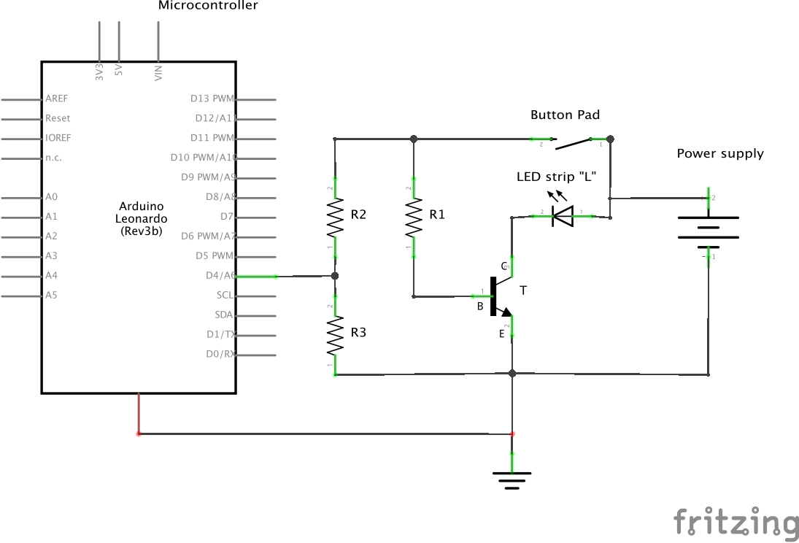
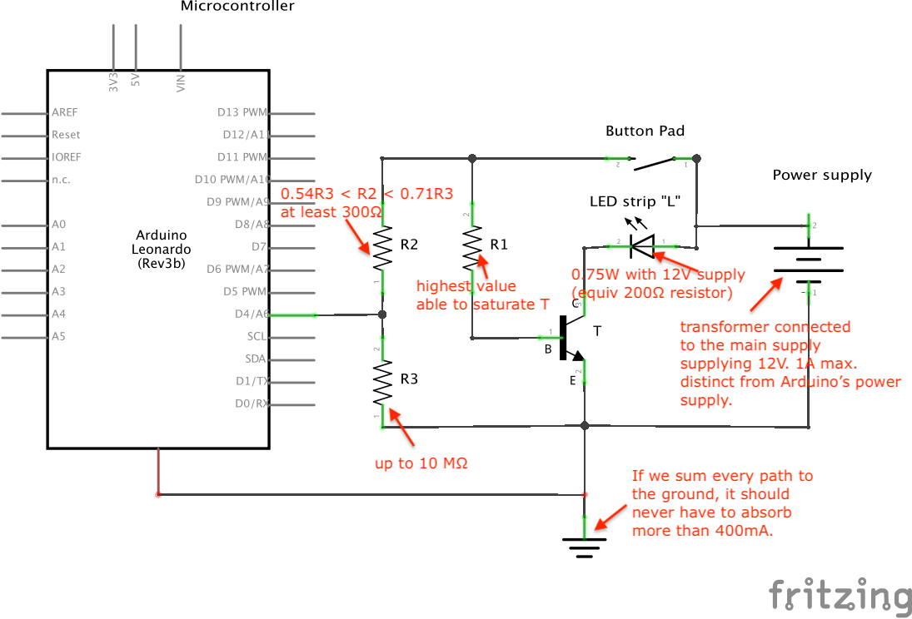
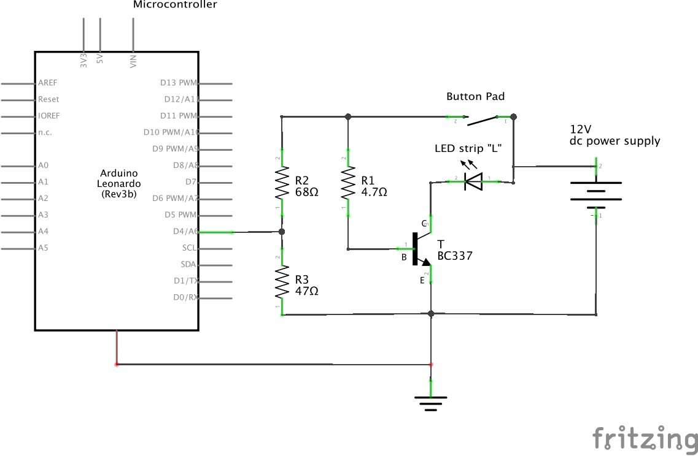
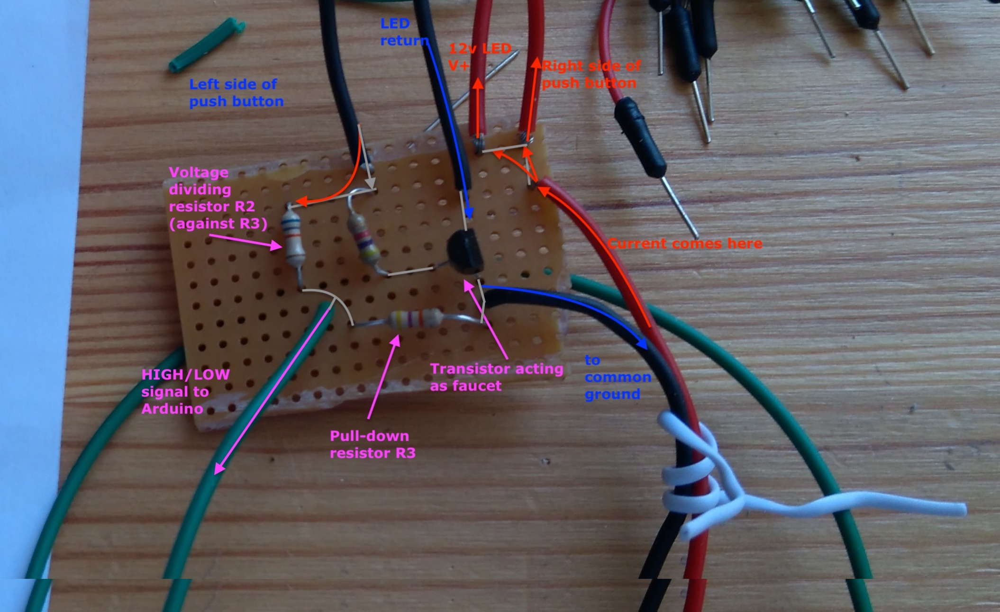

# Circuit design

## General design

Schema of the created design:



`R1`, `R2`, `R3`: Resistors
`T`: NPN Transistor (B,C,E stand respectively for Base, Collector, Emitter)
`Button Pad`: Push button consisting of a button pad pushed when stepped on
`Arduino Leonardo`: The microcontroller we decided to use

## Constraints that led to the design

### Power circuit / logic circuit

We exclude using arduino as power supply for the lights. 
It could be performed by carefully choosing LEDs and agencing them, but would limit us a lot in power used. 
Also, it would rapidly burn the pins of the arduino, not particularly designed to live long as power supply.

It means that we won't use the voltage output pins of the arduino (neither 3.3v nor 5v).
The only relation of the arduino with the closed circuit by the pad will be via its digital pin receiving HIGH/LOW.

### Power supply

Goal is to use a steady voltage source, hence choice of main supply. Obviously, we need a transformer to convert AC of the main supply to DC, with an appropriate voltage.

Battery is safer but inappropriate: would discharge relatively rapidly, and voltage supply decreases with discharge rate.
This modifies the equilibrium state of the circuit's components.

The AC/DC transformer supplied with the LED strips is perfect for our purpose. 

- supplied voltage: 12 V
- maximum amperage drawn: 1A

### LED power consumption

Tests showed that a strip of 30 cm, containing 9 LEDs, consumes `0.75W` when directly wired with the provided transformer.

- Amperage: 60-65 mA
- Voltage: 12 V (steadily provided by the transformer)

> Note: Considering the 30cm strip as the load of our local circuit, it can be mocked in tsts by a `200Ω` resistor:
> 
>`R = U / I = 12V / 0.06A = 200Ω`
>
> For some tests on the breadboard, using a resistor may be easier than connecting to the test strip.
> In case of bad manipulation, it also avoids damaging it.

### Transistor NPN
Idea is to use a transistor as a switch. 

NPN seems the right choice to me, as no current is flowing when pads are up (most of the time).
Low (but enough) current is carried to the base B when the button pad is pressed. It saturates the transistor.
It enables an almost closed circuit between collector C and emitter E, and lets the current flow.

As for transistor model, my choice goes to using one I already got (`BC337`).

### Arduino digital sense requirement

When the circuit is open, Arduino digital pin needs to be wired to the ground. It makes sure internally that current
at the pin is LOW by comparison to ground value. Otherwise, digital pin gets confused and program will receive erratically `HIGH` and `LOW` values.

Hence, it requires a connection to the ground, the amount of current being kept low by a so called pull down resistor.
On the schema, R3 is the pull-down resistor.

[rule of thumb is to use a resistor that is at least 10 times smaller than the value of the input pin impedance](http://www.resistorguide.com/pull-up-resistor_pull-down-resistor/)
As digital pins of Arduino have [100 Megohm impedance](https://www.arduino.cc/reference/en/language/variables/constants/constants/#_pins_configured_as_input), we can use up to 10 Megohm.

### Arduino voltage/amperage ratings

Arduino has voltage/amperage [maximum ratings](https://playground.arduino.cc/Main/ArduinoPinCurrentLimitations/) above which it will grill something.
- Digital pins: `40 mA`
- Ground: `400 mA`

Ground limit of 400 mA seems not to be an issue. Assuming the four 30cm-strips of the 4 pads get switched on at the same time, we are well below 400 mA of total current to be grounded. For this reasonning to be correct, It implies that current drawn via other parts of the circuit is insignificant. We shall make sure of this in following sections.

Concerning Digital pins limited to 40mA, it means that with a maximum voltage of 12 volts, each pin must be protected by a `300Ω resistor` at least.

### Arduino HIGH/LOW signals

The Arduino Leonardo is built around atmega32u4 microchip, that tolerates voltage up to 5.5V.
Also, it assimilates voltage to `HIGH` value only if above 3.5V.

This is what leads to use a voltage devider with R2 and R3. Knowing that provided voltage is 12V, R2 must dissipate between 6.5v and 8.5v.
```
(12-5.5)/12< R2/R3 < (12-3.5)/12
<=> 0.54 < R2 / R3 < 0.71
<=> 0.54R3 < R2 < 0.71R3
```

## Visual summary of the constraints and resolution

Schema to summarize:



### Resolution

#### R1

First thing to determine is the highest value possible able for R1 able to saturate the transistor.

To determine optimal value for `R1`, I fumbled around a little. Below is the report depending of `R1` values:

| R1     	| ΔVR1  	| IB      	| ΔVL   	| IL      	|
|--------	|-------	|---------	|-------	|---------	|
| 1 kΩ   	| 11.3v 	| 11 mA   	| 11.9v 	| 54 mA   	|
| 2 kΩ   	| 11.3v 	| 5.5 mA  	| 11.8v 	| 54 mA   	|
| 4 kΩ   	| 11.3v 	| 2.85 mA 	| 11.8v 	| 54 mA   	|
| 6.6 kΩ 	| 11.3v 	| 1.7 mA  	| 10.5v 	| 47.7 mA 	|
| 10 kΩ  	| 11.3v  	| 1 mA    	| 8.18v 	| 37 mA   	|

- `R1` : resistance value of R1
- `ΔVR1` : difference of voltage between R1 terminals
- `IB`: current going through the base
- `ΔVL`: voltage drop between Load terminals (in these tests, LED strip was mocked by a 200Ω resistor)
- `IL`: current going through the load

It is very clear that amplification factor of the transistor has no impact until 5kΩ or so, aka transistor is saturated.
Then we find our ± 30x amplification factor.

Simplest and optimal closest Resistor value for R1 is therefore 4.7 kΩ.

It means that when circuit is closed.
- current going through Load: `54 mA`
- current going through transistor's base: `U/R = 12/4700 = 2.5 mA`
This respects the idea that close to 100% of current is drawn by the LED strip.

#### R2 and R3

R2 depends on R3. I consider that having R2 + R3 ± 100 kΩ is reasonnable. Let's compute:
- current going through Load: `54 mA`
- current going through transistor's base: `U/R = 12/4700 = 2.5 mA`
- current going through R2 then R3: `U/R = 12/100000 = 0.12 mA`
- current going through R2 and pin: `U/R = 12/(R2+100000000) ~ 0 `

If we round it up to 60mA current a pad, it means that activating all 4 pads at the same time (which never happens) would draw to ground 240 mA. There remains a comfortable margin before reaching the maximum 400 mA of Arduino's rating.

Also, it makes me things easier because existing resistor values of 47kΩ and 68kΩ amount to more than 100kΩ, and:
- `68kΩ/47kΩ = 0.69`

It means that R2 = 47kΩ and R3 = 68kΩ respects the above target: ` 0.54R3 < R2 < 0.71R3`.

Yay !


## Decisions and final design

Schema of the final design:




Now you can go get [electronic supplies](./purchaseList.md#electronics-and-wiring-supplies) and [electronic tools])(./purchaseList.md#electronics-assets) and execute! Here is what it should look like:



## Conclusion

At this stage, you are advised to make a complete board, test it thoroughly, then reproduce for the 3 other boards. 
Each board will be connected to the same input line and ground line.
Each board will be connected to its dedicated LED strip.
Each will be connected to a dedicated input pin of the arduino.

For each circuit, when its button pad is pressed, the HIGH signal is sent to the dedicated pin, and can be used in a program. At the same time, the connected LED strip lights on.

